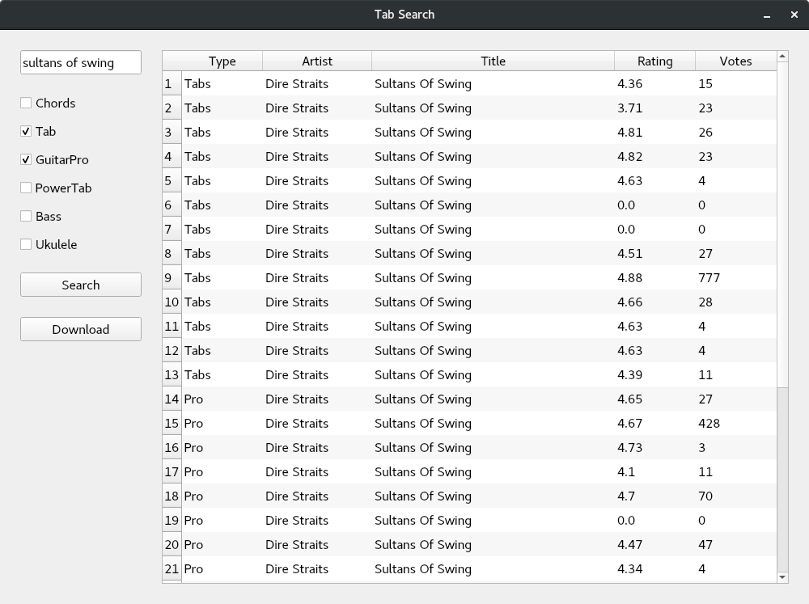
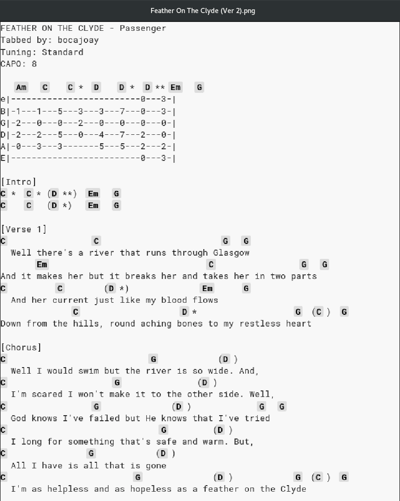
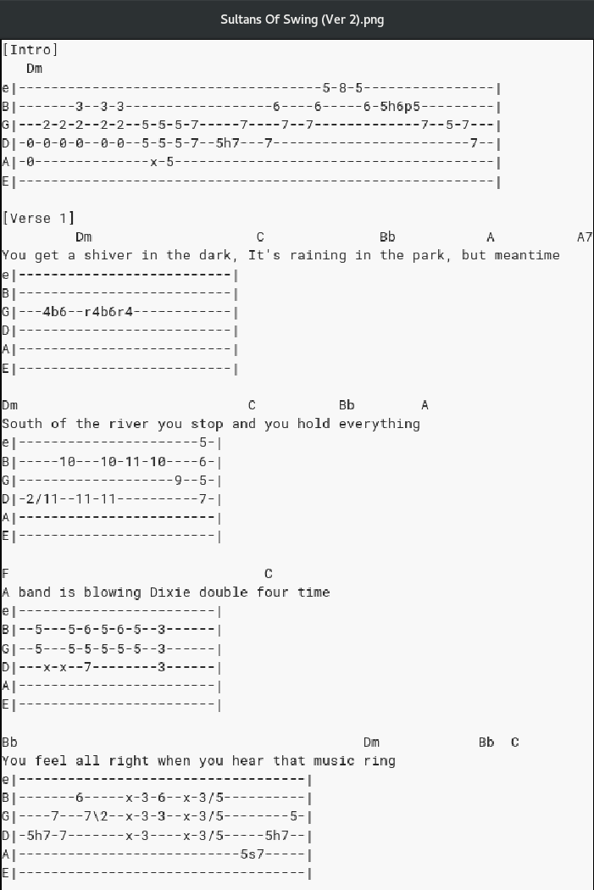

# tab-scraper
An interface for downloading guitar tabs from Ultimate Guitar.

Get screenshots of Guitar Chords, Tabs, Bass Tabs and Ukulele Chords with no clutter.

Chords  |   Tab
:------:|:------|
 | 

You can also download GuitarPro and PowerTab files.  
All files are sorted into directories for quick and easy access.

### Prerequisites

1. Python 3
2. Firefox Web Browser
3. [Geckodriver](https://github.com/mozilla/geckodriver/releases) for Firefox

### Running the Program

##### Command Line

1. Open settings.cfg and enter in the root directory where you would like all tabs to be stored e.g. <i>username/Music/Tabs/ </i>
2. In settings.cfg, enter the installation directory for geckodriver
3. Run `pip install -r requirements.txt`
4. run `python tab-scraper.py` from <i>/src/</i> directory

### Built With

- Python 3

- [PyQT5](https://pypi.org/project/PyQt5/)

- [Selenium](https://selenium-python.readthedocs.io/)

- [Geckodriver](https://github.com/mozilla/geckodriver/releases)

### To Do

- Download messages on interface (in progress, complete)
- Set download root through interface instead of manually in the settings.cfg
- Drive/Dropbox integration
- Bare bones PyQT to reduce binary size